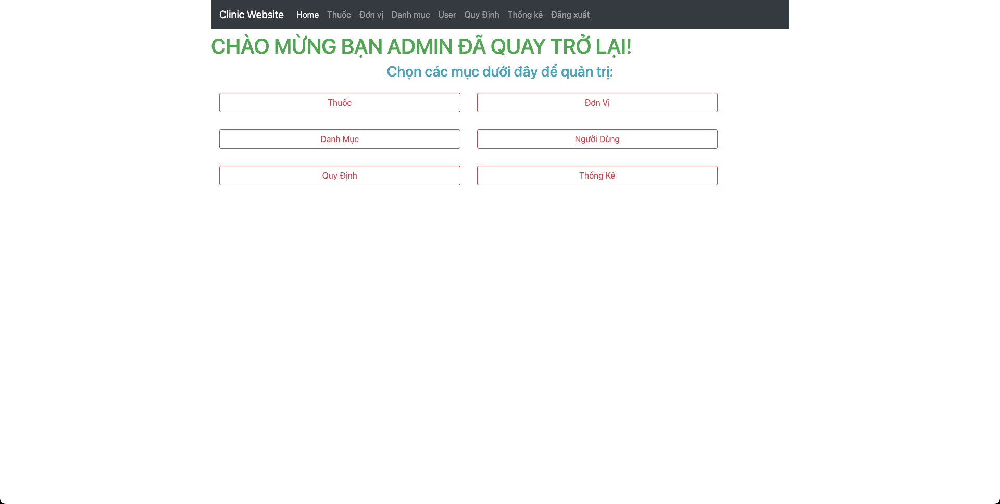
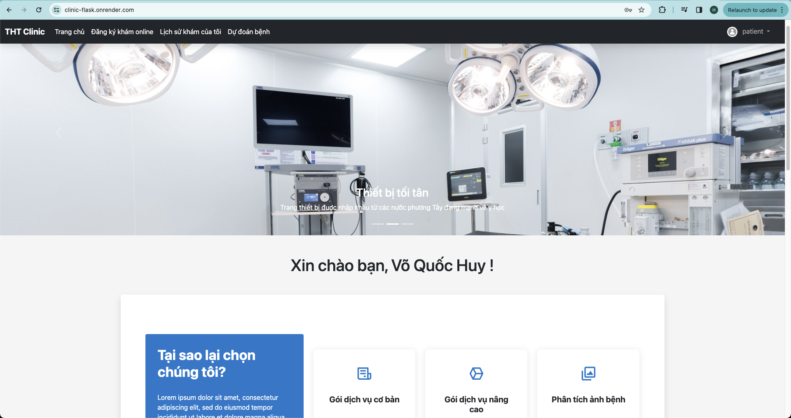
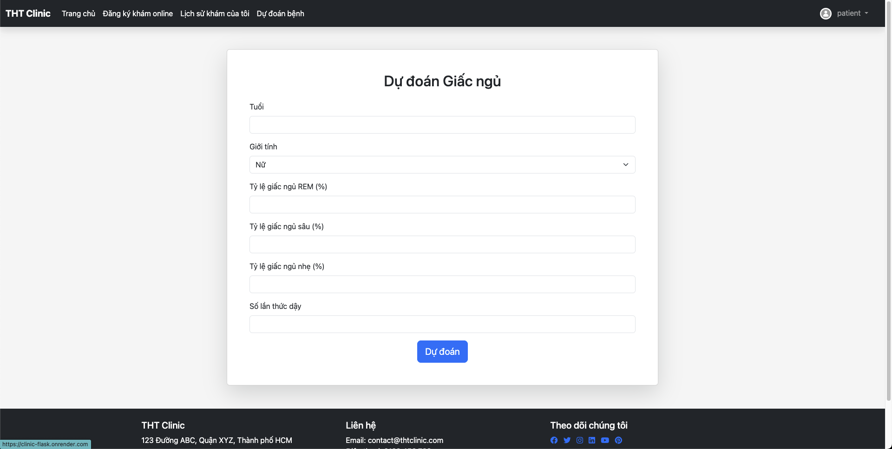
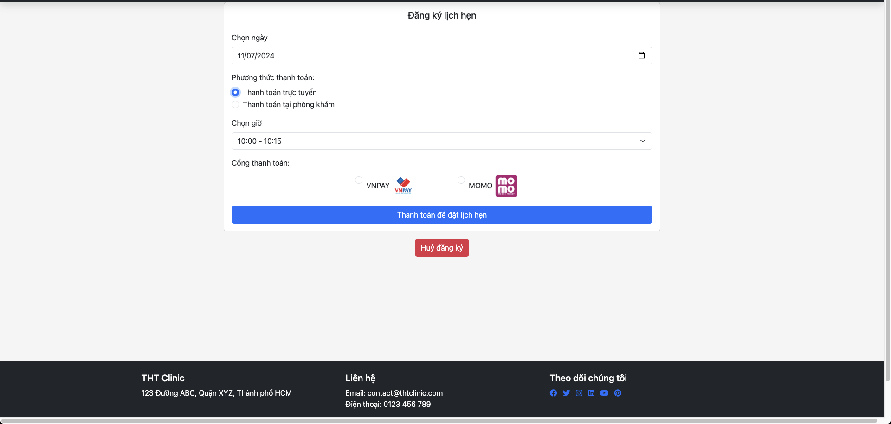
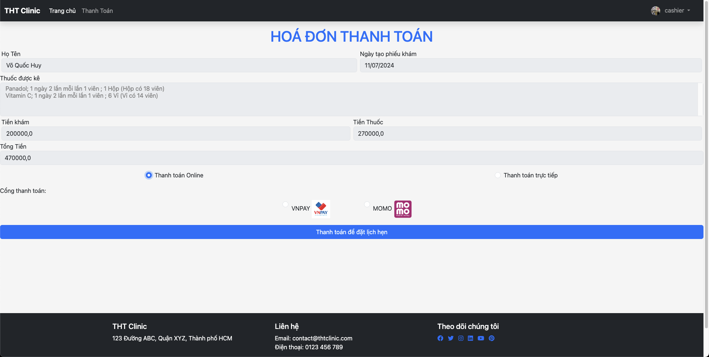
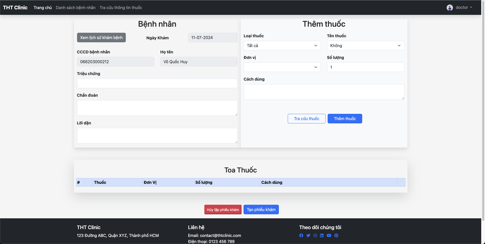
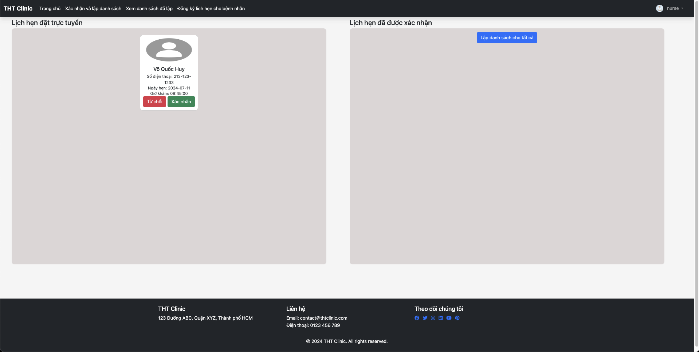

# Private Clinic Website

## Overview
The Private Clinic Website project was developed between February 2024 and May 2024. It is a comprehensive full stack application designed to streamline various clinic operations, including appointment scheduling, medication prescription, payment processing, and sleep quality prediction using machine learning.

## Table of contents

- [Features](#features)
- [System Architecture](#technical-stack)
- [Database Schema Diagram](#database-schema-diagram)
- [Getting Started](#demo)
- [Admin site UI](#admin-ui)
- [User site UI](#user-ui)


## Technical Stack
- **Backend Framework:** Flask
- **Template Engine:** Jinja
- **Database:** MySQL
- **Machine Learning:** Custom models for sleep quality prediction
- **Containerization:** Docker
- **Task Management:** Scrum methodology using Trello

## Main Features
### Appointment Scheduling
- Users can book, reschedule, and cancel appointments with ease.
- Calendar integration for better visibility of available slots.

### Medication Prescription
- Doctors can prescribe medications directly through the platform.
- Patients receive notifications and reminders for their prescriptions.

### Payment Processing
- Secure online payment options integrated with VNPAY and MoMo.
- Detailed transaction history for both patients and clinic administrators.

### Sleep Quality Prediction
- Self-researched machine learning model to predict and analyze sleep quality.
- Users can track their sleep patterns and receive recommendations for improvement.

## Database Schema Diagram


## Deployment
The application is deployed to ensure a basic user experience, making it accessible and user-friendly for both patients and clinic staff.

### Demo
Our Client website deployed at [Private Clinic Website]([http://sw-rental.xyz](https://clinic-flask.onrender.com/))

**Here are demo account:**

```bash
# ROLE: username - password
ADMIN: admin - 123
PATIENT: patient - 123
NURSE: nurse - 123
DOCTOR: doctor - 123
CASHIER: cashier - 123
```

## Admin site UI

</img>

## User site UI

</img>
</img>
</img>
</img>
</img>
</img>


                              **[Private Clinic Website]([http://sw-rental.xyz](https://clinic-flask.onrender.com/))*


